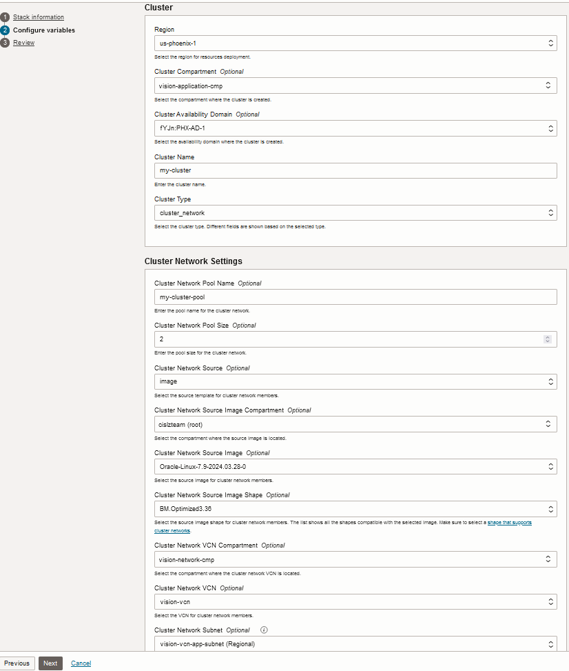

# Cluster Networks and Compute Clusters


## Introduction

This stack deploys cluster networks and compute clusters in OCI using the [cis-compute-storage module](../../). 

A [cluster network](https://docs.oracle.com/en-us/iaas/Content/Compute/Tasks/managingclusternetworks.htm) is a pool of high performance computing (HPC) instances that are connected with a high-bandwidth, ultra low-latency network. They're designed for highly demanding parallel computing jobs.

A [compute cluster](https://docs.oracle.com/iaas/Content/Compute/Tasks/compute-clusters.htm) is a remote direct memory access (RDMA) network group. You can create high performance computing (HPC) instances in the network and manage them individually.

This stack can be deployed with OCI Resource Manager service (RMS) or Terraform CLI.

## Deploying with RMS

1. Click [](https://cloud.oracle.com/resourcemanager/stacks/create?zipUrl=https://github.com/oracle-quickstart/terraform-oci-secure-workloads/archive/refs/heads/issue-523-rms.zip)
2. Accept terms, wait for the configuration to load. 
3. Set *Working directory* to *terraform-oci-secure-workloads-issue-523-rms/cis-compute-storage/examples/clusters*. **Make sure to select this directory**.
4. Give the stack a name in the *Name* field.
5. Set *Terraform version* to 1.2.x. 

See screenshot below as guidance:


6. Click *Next*. 
7. a) **For deploying a cluster network**, use the following screenshot as guidance: 



7. b) **For deploying a compute cluster**, use the following screenshot as guidance: 


8. Click *Next*. 
9. Uncheck *Run apply* option at the bottom of the screen. Click *Create*.
10. Click the *Plan* button.
11. Upon a successfully created plan, click the *Apply* button and pick the created plan in the *Apply job plan resolution* drop down.


## Deploying with Terraform CLI

Besides deploying, we also show how to utilize [Terraform workspace](https://developer.hashicorp.com/terraform/language/state/workspaces) for having Terraform managing separate state files for cluster network and compute cluster deployments. If this same configuration is used to manage both cluster network and compute cluster, the workspace will keep cluster network and compute cluster Terraform state files separated.

**Note**: When using Terraform workspaces, always remember to switch to the desired workspace before making any terraform plan/apply.

For switching back and forth between workspaces, execute:
```
terraform workspace select <workspace-name>
```

### Deploying a cluster network:

1. Rename *cluster_network.tfvars.template* to *cluster_network.tfvars*
2. In *cluster_network.tfvars*, provide meaningful values by replacing the strings marked with \<\>.
3. In this folder, run the typical Terraform workflow with a Terraform workspace. The workspace will isolate the state file for the cluster network. 

```
terraform init
terraform workspace new cluster_network ## this creates and switches to the cluster_network workspace in a single step.
terraform plan -var-file ./cluster_network.tfvars -out plan.out
terraform apply plan.out
```

### Deploying a compute cluster:

1. Rename *compute_cluster.tfvars.template* to *compute_cluster.tfvars*
2. In *compute_cluster.tfvars*, provide meaningful values by replacing the strings marked with \<\>.
3. In this folder, run the typical Terraform workflow with a Terraform workspace. The workspace will isolate the state file for the compute cluster.
```
terraform init
terraform workspace new compute_cluster ## this creates and switches to the compute_cluster workspace in a single step.
terraform plan -var-file ./compute_cluster.tfvars -out plan.out
terraform apply plan.out
```